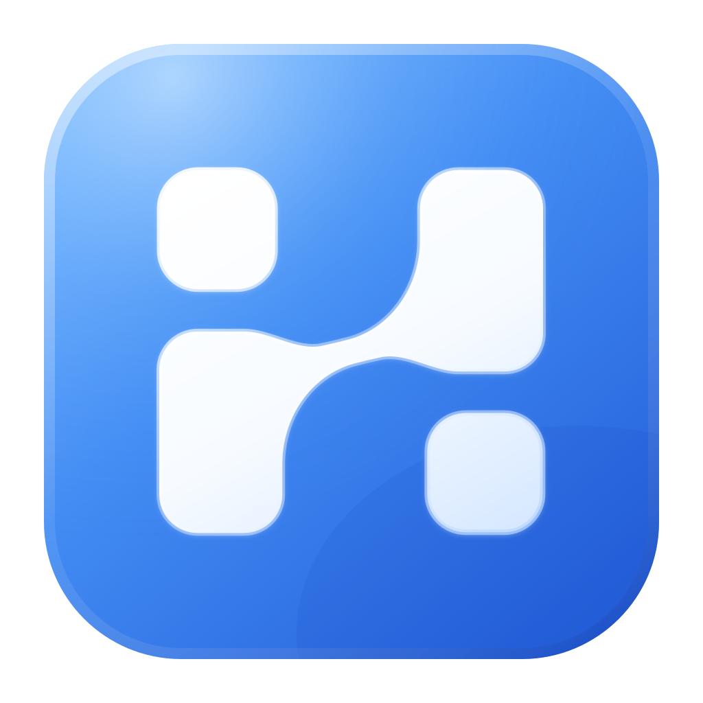

<div align="center">



# HushClaw

### 多模型协作，持续懂你。

**本地优先，隐私由你掌握。**

一个连接多模型、多 Agent 与个人记忆的 AI 工作空间。<br>
让不同的能力，围绕同一个你持续积累。


[快速开始](#quick-start) · [模型与路由](#models) · [个人记忆](#memory) · [文档](#docs)

</div>

---

| 多模型，多种能力 | 同一份记忆，持续懂你 | 本地优先，保护隐私 |
| :--- | :--- | :--- |
| 连接全球模型，按任务选择模型、组织 Agent 协作。 | 让偏好、项目背景与经验跨会话、跨模型延续。 | 个人记忆与工作数据由你在本地持有、管理和备份。 |
| **能力可以切换。** | **理解持续积累。** | **数据属于你。** |

模型越来越多，Agent 越来越多，工作也分散在不同产品里。你的偏好、背景和经验，需要一处可以长期积累的地方。

HushClaw 把模型调用、Agent 协作、资料整理与个人记忆放进同一个本地工作空间。你可以切换模型、为任务选择不同助手，并按需连接外部工具；已保存的个人上下文留在 HushClaw 中，在权限和记忆范围内按需使用。随着你的表达、反馈与修正，这份理解持续更新。

<a id="local-first"></a>

## 01 · 本地优先，把隐私放在起点

HushClaw 运行在你的电脑上，通过浏览器使用。聊天记录、记忆、任务和配置在本地管理，工作文件也留在设备上；支持备份和迁移。

- **本地运行**：默认单用户部署，服务默认监听本机地址。
- **本地持有**：个人记忆独立于模型账号和模型供应商保存。
- **本地保护**：一键安装默认启用 SQLCipher 数据库加密，密钥优先使用系统凭据库。

使用云模型时，完成任务所需的消息、文件片段和检索到的记忆会发送至配置的模型服务；联网工具和已启用的连接器也会访问外部服务。本地优先描述的是数据的持有与管理方式。

<a id="models"></a>

## 02 · 让任务选择适合的模型

**VoxNexus 是默认的统一模型入口。** 登录后，在 Settings 一级页面即可查看可用模型、切换主模型、配置后台模型、查询剩余额度和充值。

| 使用场景 | 如何选择 |
| :--- | :--- |
| 日常对话与复杂问题 | 为主对话选择合适的模型，按需要切换。 |
| 记忆提取与后台整理 | 配置独立后台模型，平衡能力与成本。 |
| 专项任务与多 Agent 协作 | 为不同 Agent 配置模型与工具，再通过指定 Agent、广播或流水线组织任务。 |

模型列表由网关实时提供，上游路由由网关负责。**具体覆盖范围、价格与可用性以当前网关列表为准。** 切换模型不会更换本地记忆库。

<details>
<summary><strong>开发者：直接接入模型与扩展 Provider</strong></summary>

底层保留 Anthropic、OpenAI / OpenAI-compatible、Google Gemini、Ollama 等适配器，供高级 CLI、库调用及自定义部署使用。对应 SDK 依赖按需安装。

默认 WebUI 统一使用 VoxNexus；其他 Provider 的配置方式见[技术参考](docs/technical-reference.md#config)。

</details>

<a id="memory"></a>

## 03 · 跨越模型，让理解持续积累

你的记忆由 HushClaw 保存在本地。每次提问时，它会从已有记录中选取相关背景，交给当前模型使用，让不同模型都能接续你的工作。

| 记住什么 | 如何帮助下一次对话 |
| :--- | :--- |
| **你的偏好** | 沟通方式、工作习惯、常用表达和关注方向。 |
| **你的项目** | 资料、事实、目标，以及已经做出的决定。 |
| **你的观点** | 保留观点的演变、修正与适用条件。 |
| **你的经验** | 从任务结果和纠正中沉淀可供检索的经验。 |

例如，你在一个模型下说明了“汇报先给结论，并列出风险”，保存为个人偏好后，切换模型仍可检索到这条记录。你也可以在回答的 **本次理解** 中查看所引用的个人记忆，确认有用的内容，纠正不准确的记录。

**长期保存、按需唤起、由你修正。** 保存的记忆不会因为换模型而清空；每次召回仍受相关性和上下文预算影响，不同模型的理解和表现也会有所不同。

这里的“懂你”，来自可查看的个人记录、可追溯的来源和你给出的反馈。你可以确认、纠正或停止引用某条记录，让今后的回答更贴合当前的自己。

<a id="quick-start"></a>

## 几分钟，开始你的本地工作空间

**macOS / Linux**

```bash
bash <(curl -fsSL https://raw.githubusercontent.com/CNTWDev/hushclaw/master/install.sh)
```

**Windows · PowerShell**

```powershell
irm https://raw.githubusercontent.com/CNTWDev/hushclaw/master/install.ps1 | iex
```

安装程序会准备 Python 环境、安装运行依赖、初始化本地数据库并启动服务。日常使用无需 npm 构建，也无需 Docker。

1. 打开 [本地工作空间](http://localhost:8765/personal)。
2. 进入 **Settings → 个人中心**，通过系统浏览器登录 VoxNexus。
3. 确认可用额度；需要时充值，然后选择主模型和后台模型。
4. 开始对话，添加资料，让个人上下文在使用中持续积累。

默认网关地址与 `hushclaw-desktop` 客户端已内置。登录使用系统钥匙串保存令牌；浏览器与 HushClaw 服务需运行在同一台电脑上。部署详情见 [VoxNexus 接入说明](docs/voxnexus.md)。

## 一个空间，完成日常工作

| 功能 | 你可以做什么 |
| :--- | :--- |
| **Chat** | 流式对话、资料分析与文件处理；执行中只保留一条简短状态。 |
| **Memories** | 查看个人偏好、知识笔记、观点与经验，核对来源并修正记录。 |
| **Files** | 管理导入与生成的文件，搜索、标记、评级、预览和下载。 |
| **Agents & Skills** | 为不同工作配置助手、工具与技能，组织协作任务。 |
| **Tasks & Calendar** | 管理任务和行程，按需连接本机日历或外部日历来源。 |
| **Connections** | 按需接入邮箱、浏览器和其他外部服务。 |

开发者模式为 Runtime 面板增加工具输入与结果预览，详细过程与正文分开呈现。外部连接器需要独立授权，并取决于操作系统、配置和已安装的扩展。

## 带走你的积累

本地数据目录：

| 系统 | 位置 |
| :--- | :--- |
| macOS | `~/Library/Application Support/hushclaw/` |
| Linux | `~/.local/share/hushclaw/` |
| Windows | `%LOCALAPPDATA%\hushclaw\` |

```bash
hushclaw backup export                     # 导出本地备份
hushclaw backup import /path/to/backup.zip  # 在目标设备恢复
hushclaw database status                   # 查看数据库加密与完整性状态
```

加密数据库的备份保留加密，恢复密钥需单独妥善保存。数据库加密范围不包含所有工作文件和导出文档；完整保护范围与迁移方法见[本地数据安全](docs/technical-reference.md#local-data-security)。

<details>
<summary><strong>开发与扩展</strong></summary>

需要 Python 3.11+。从源码安装：

```bash
git clone https://github.com/CNTWDev/hushclaw.git
cd hushclaw
python -m venv .venv
source .venv/bin/activate  # Windows: .venv\Scripts\Activate.ps1
pip install -e ".[server,encryption]"
hushclaw serve
```

核心可独立嵌入，无强制第三方依赖；服务、模型 SDK、浏览器和连接器按需使用扩展依赖。WebUI 随包提供预构建静态资源。

- **工具**：通过 Python `@tool` 接口扩展能力。
- **技能**：使用 `SKILL.md` 组织可复用的工作方式。
- **运行时**：Agent 内核、个人发行版与 WebUI / CLI 分层，统一处理上下文、工具和记忆。

查看[架构与配置参考](docs/technical-reference.md)了解多 Agent、Provider、工具发现和开发命令。

</details>

<a id="docs"></a>

## 继续了解

| 文档 | 内容 |
| :--- | :--- |
| [VoxNexus 接入](docs/voxnexus.md) | 登录、模型选择、额度、充值与部署配置。 |
| [技术参考](docs/technical-reference.md) | 运行时架构、记忆系统、高级配置、升级与迁移。 |
| [记忆架构](docs/memory-evolution-architecture.md) | 个人上下文与记忆演进的技术设计。 |
| [Google Calendar](docs/google-calendar.md) | 可选日历连接的配置说明。 |
| [界面设计规范](docs/ui-design-system.md) | 界面结构与交互约定。 |

---

<div align="center">

**HushClaw · 多模型协作，持续懂你。**<br>
本地优先，隐私由你掌握。

</div>
