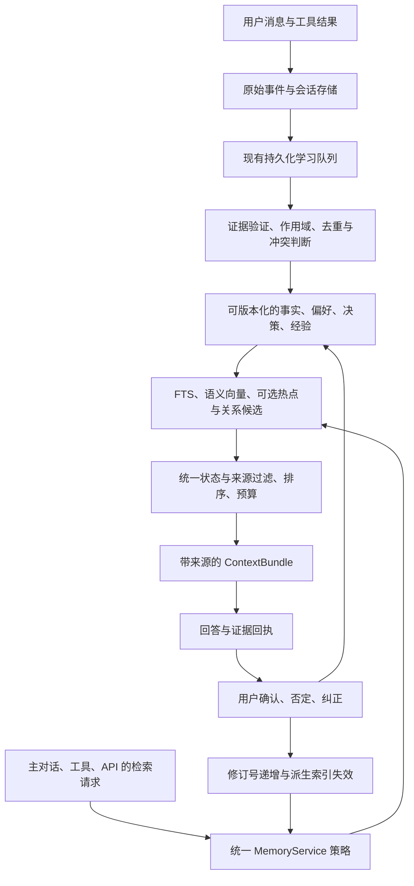

# Engram Memory 调研与 HushClaw memory 升级建议

日期：2026-09-22。状态：调研与升级记录。

## 结论与调研边界

本报告暂按 **Engram Memory LLC / engrammemory.ai / EngramMemory/engram-memory** 理解用户所说的 Engram。尚未获得用户对具体项目的确认；Engram-Locus、DeepSeek Engram、其他同名开源仓库不属于本次比较对象。

**建议保留 HushClaw 的本地 SQLite、原文证据和后台学习体系，吸收 Engram 的检索分层、统一引擎和生命周期管理思路。没有足够证据证明整体替换成 Engram 会更好。** 优先顺序是规则一致性与纠错可靠性 → 语义召回质量 → 可追溯的记忆更新 → 经测量后再扩展索引。

审阅版本：

- HushClaw：`3b24f18b1a74e7886abbb93a760ab50b62bf71ec`，开始调研时工作区干净。
- Engram：`761a7da48495b0d5ddf7e1d505bf6e8c8f6d7101`，公开源码只读下载到 `/tmp/hushclaw-engram-review-20260922`。
- 官网内容与当前代码有差异，以固定提交的实现描述为准。未部署 Engram、未运行双方统一效果或延迟 benchmark；以下“更适合”属于架构判断，不是实测排名。

## Engram 的理念与实际架构

核心理念是把记忆做成 Agent 外部、跨会话复用、用户可控制的基础设施。保留传入内容，检索时再挑选；让近期、频繁使用和被确认有用的记忆更容易被找回；把昂贵的处理尽量移出生成式 LLM 的逐次检索路径。

公开社区版本的主要组成是 MCP/REST、FastEmbed 本地 embedding、Qdrant、内存热点层、多头 LSH，以及可选的 Kuzu 关系图。当前引擎的实际读取流程为：

```text
查询 → 本地 embedding
     → 热点候选 + LSH 候选 + Qdrant dense/BM25 候选
     → 可选图扩展 → cosine 重排 → 有用性反馈加权
     → 可选 cross-encoder → 返回 top-k
```

应区别看待“论文/营销理念”和“实现”：

1. **不是可靠的三级短路。** `recall_engine.py:758` 明确禁止热点命中后提前返回，`:817` 的 hybrid search 总是执行。其原因是热点强度与语义相关性可能不一致。因此热点命中率不能等同于“省掉一次向量检索”的比例。
2. **ACT-R 是相关性之外的辅助信号。** `hot_tier.py` 使用访问时间记录计算 activation，并带稳定性修正。当前最终排序会重新计算 cosine。不能把“经常被检索”当成“信息正确”。
3. **冲突检测不是通用事实推理。** `_check_conflicts()` 先检索相似内容，再匹配英文 `prefer`、`always/never/not` 等规则。中文、条件变化和实体区分不能据此保证。
4. **去重不等于事实整合。** `consolidation.py:113` 起选择相似簇中最长文本作为新记录，再删除原记录；这不足以保留多份证据、例外条件和历史版本。HushClaw 不宜照搬这种合并策略。
5. **“无生成式 LLM 调用”不等于零推理。** embedding 本身需要模型推理；代码支持可选 cross-encoder，配置默认关闭。若传入文本由 Agent 总结而来，上游抽取仍可能消耗 token。
6. **社区版与云服务分开判断。** 官网平台文档描述云端处理、自有向量存储；当前 README 又描述设置 API key 后的本地与云双写。因此“本地保存”不必然意味着“内容不会发送到云”。专有压缩状态也会带来迁移依赖。

来源：[平台概览](https://engrammemory.ai/docs/platform/overview/)、[固定版本 README](https://github.com/EngramMemory/engram-memory/blob/761a7da48495b0d5ddf7e1d505bf6e8c8f6d7101/README.md)、[检索引擎](https://github.com/EngramMemory/engram-memory/blob/761a7da48495b0d5ddf7e1d505bf6e8c8f6d7101/src/recall/recall_engine.py)、[热点层](https://github.com/EngramMemory/engram-memory/blob/761a7da48495b0d5ddf7e1d505bf6e8c8f6d7101/src/recall/hot_tier.py)、[整合实现](https://github.com/EngramMemory/engram-memory/blob/761a7da48495b0d5ddf7e1d505bf6e8c8f6d7101/src/recall/consolidation.py)。

### 如何看待 benchmark

官网首页与其链接的研究页使用不同口径：首页是 300 memories、25 queries、3 rounds；研究页是 100 memories、50 queries、5 runs。研究页比较本地 Engram 与云端对手，网络开销和抽取策略不一致。重复同一确定性数据集得到零方差，也不意味着对未知查询的统计不确定性为零。

研究页的 Recall@10=1.00 是其检索实验结果，不能推导出真实回答必然正确，也不能证明中文偏好变化、拒绝旧记忆、跨项目隔离、长期时序推理更好。本次下载的版本有 LongMemEval 检索脚本，但未找到研究页指定的 `benchmarks/competitive_benchmark_2026.py`。现有证据不足以复现该页全部对比。

来源：[厂商研究页](https://engrammemory.ai/research/competitive-benchmark-2026/)、[官网](https://engrammemory.ai/)、[当前 benchmark 目录](https://github.com/EngramMemory/engram-memory/tree/761a7da48495b0d5ddf7e1d505bf6e8c8f6d7101/benchmarks)。

## HushClaw 的实际起点

当前代码比 `docs/memory-evolution-architecture.md` 的旧图完整。旧图仍把 `after_turn()` 写成正则抽取；现在该方法为空操作，语义学习在 `LearningController` 和持久化学习队列执行。

| 维度 | 当前 HushClaw | 判断 |
|---|---|---|
| 原始经历 | turns、events、session log、artifacts、working state | 已有基础，应继续保留原文与派生记忆的区别 |
| 用户模型 | profile、观点线程与事件、belief models | 已具备，不需要为借鉴 Engram 重新搭一套 |
| 证据与纠错 | source_message_id、原文 user_quote 入库门槛、confirmed/rejected、回答证据回执 | 是现有优势，但规则没有覆盖所有入口 |
| 后台处理 | 持久化 learning_jobs、lease、retry、失败状态 | 已具备恢复能力，应扩展现有队列 |
| 检索 | FTS5、向量、`search()` 中的 RRF；多个入口仍各自实现 | 需要统一，而不是再次增加一个独立召回流程 |
| 默认 embedding | 确定性的 512 维哈希词频，中文二元切词 | 并非神经语义 embedding，改写和无同词表达是弱项 |
| 向量搜索 | 按 scope/model 过滤后在 Python 扫描全部向量 | 大规模时有性能瓶颈，但尚无本项目容量/延迟数据 |
| 部署 | 标准库核心、本地 SQLite，可选 Ollama/OpenAI | 符合轻量个人 Agent 定位；重型后端应可选 |

主对话默认路径实际上是 `ContextAssembler → PersonalizationStore.context → MemoryStore.search`，不是旧图的 `recall_with_budget()`。主路径已有拒绝记录及失效来源过滤，使用 `estimate_tokens()` 控制预算。工具路径则经 `SQLiteMemoryPort._read_search()`，与主路径规则不同。

### 已验证的问题

在临时数据库里写入 `amber storage`，标记为 `rejected`，用相同查询调用各入口：

| 入口 | 是否返回已否定记录 |
|---|---|
| `MemoryStore.search()` | 否 |
| `PersonalizationStore.context()` | 否 |
| `SQLiteMemoryPort.search()` | **是** |
| `MemoryStore.recall_with_budget(min_score=0)` | **是** |

另一次验证先调用 `recall_with_budget()`，删除 note，再以相同 session/query 调用，仍得到删除前的字符串。此路径缓存 TTL 为 30 秒；`remember/update_note/delete_note` 没有统一使缓存失效。这是已复现的入口一致性问题，不等于当前主对话必然受影响。

静态审阅另发现：

- `search()` 已采用 RRF，但 budget recall 和 port 仍使用原始 FTS/cosine 加权和及 FTS shortcut；检索分数不可直接视为统一置信度。
- 自动事实抽取以标题是否存在做去重；它会跳过同标题的新内容，不能表达“旧事实被新事实替代”。
- `_extract_facts_llm()` 没传 scope，沿用 `global` 默认；工具 `remember` 则会按 agent/workspace 选择 scope。自动写入与手动写入的作用域策略需统一。
- 用户 profile 同 category/key 直接更新，观点已有事件历史；不同记忆类型的版本语义还未统一。
- workspace scope 使用目录 basename；同名目录可能碰撞。应迁移为稳定 workspace ID，并兼容读取旧 scope。
- 主路径 personalization 不消费旧 recall 的 decay/max_age 参数；UI 中展示的衰减标签也不能当成真实检索策略已生效的证据。

本地核查执行：`python3 -m pytest tests/test_personalization.py tests/test_memory.py tests/test_evolution.py -q`，**125 passed**。以上两项临时数据库复现说明现有测试仍未覆盖跨入口一致性。未对生产数据做任何实验。

## 升级设计：统一策略，保留分层



以下是针对 HushClaw 的设计建议，并非声称 Engram 已完整实现。

### P0：先让“忘掉、纠正、只在本项目有效”真正一致

- 增加共享 `MemoryService`/retrieval policy；`MemoryStore.search`、`recall_with_budget`、`SQLiteMemoryPort`、personalization 的 notes 路径都调用它。保留公开 API，先消除重复策略。
- 所有候选在进入 top-k 和预算分配前，应用同一套 scope、kind、feedback、来源可用性及状态规则；所有缓存命中也必须遵守当前状态。
- 明确 `scopes=None` 与 `scopes=[]` 的不同语义，fallback 不得丢失过滤条件。由运行时统一构建作用域，不把模型传参当作隔离保证。
- 所有写入、修改、删除、否定和来源移除都递增持久化 `memory_revision`；缓存键包含 revision、scope、模型版本和检索配置。跨连接写入同样可见。
- 把预算主路径统一到现有 `estimate_tokens()`；避免一处中文按估算器计费，另一处简单除以 4。
- 为两项已复现问题补回归测试，并覆盖删除后各入口、重启、短句追问、同名 workspace、scope fallback。

验收：已否定/删除/来源不可用记录在所有读取入口均不返回；纠正下一轮即生效；跨项目用例不串记忆。零容忍用例要求 100% 通过。

### P1：先提升语义质量，再讨论热点层

- 保留默认无额外依赖模式，把 local 哈希后端明确标成“轻量词法检索”。为需要中文语义的用户提供可选本地神经 embedding；先复用已有 Ollama 通道评测，是否增加 FastEmbed 再按效果、资源和部署体验决定。
- 用统一的 RRF 产生候选；RRF 是排序信号，不是相关性概率，仍需为不同后端建立无关查询拒绝阈值。不要沿用旧 `min_score` 数值并假定语义不变。
- 输出结构化候选与来源，再统一分配预算；按问题保留相关句子和条件，不再只截正文头部 300/600 字。
- 如仍有必要，增加可选本地 reranker。中文效果必须通过本项目数据验证，不直接复制 Engram 的模型默认值。
- embedding 升级采用新旧索引并存、记录 model/dim/version、后台补索引、shadow 对比、配置切换；原文与旧索引可用于回滚。不要清库重建。

验收：同义改写、中文省略追问、术语混用的召回提高；无关记忆注入率不升；固定 token 预算和相同回答模型下比较回答正确率。

### P2：把记忆从追加文本升级成可纠正的知识

- 在现有 notes/profile/opinion 之上逐步增加统一元数据：`status`、`revision`、`source_role`、证据引用、`valid_from/valid_to`、`supersedes`。有追溯历史需求时另记录系统获知时间，不混淆“何时发生”与“何时得知”。
- 自动抽取先生成候选，再通过现有原文证据门槛。精确重复按内容指纹与来源做幂等；语义相似只生成整合候选，不能单凭 cosine 删除。
- 显式纠正优先；有条件的新偏好保留条件；不确定矛盾标记 disputed。旧版本可供“当时怎么决定”查询，默认当前状态查询排除已替代项。
- 区分“用户原话”“外部资料”“模型推断”“工具证实”。用户赞同和来源事实核实是不同状态，不能互相替代。
- 扩展现有 `PersonalLearningWorker`，为每个来源修订和处理阶段建立幂等键，避免部分成功后重试重复写入。
- 合并常规 profile/opinion/fact 抽取为一次结构化后台任务是可选优化；先测质量，保留各类验证器。立即保存原文，派生失败可重放。
- 衰减控制默认召回优先级，不能自动等同于物理删除。用户要求忘记时清理派生摘要、索引、缓存和证据引用，并防止后台任务重建；备份保留遵循既有独立策略。

验收场景：“之前喜欢 A，现在改用 B”；“工作用 A，私人用 B”；“我只是问过 A，并没认可”；“模型建议 A，用户未采纳”；“删除来源时后台学习仍在运行”。

### P3：数据证明需要时才引入规模优化

- 先测 1k/10k/100k 条记录的冷/热检索 p50/p95、峰值内存与索引更新成本，再决定 ANN、热点缓存、Qdrant adapter。
- 热点缓存先按 scope/revision 做正确隔离；精确查询缓存容易验证，语义缓存必须额外处理否定、时间和条件差异。
- 单独记录 retrieved、included、user-confirmed-useful、rejected。检索次数不应无限自增强；“回执对应了这条记忆”也不是回答受到它影响的因果证明。
- 先用 SQLite 关系表表达 `supersedes/supports/contradicts/derived_from`；只有多跳关系任务有明确收益时才考虑图数据库。
- 外部记忆服务作为可选 MemoryPort/Knowledge Connector adapter；继续遵循 ADR-0010 的个人私有存储与显式共享边界，不默认把个人记忆同步给第三方。

## 评测与发布方式

建议建立 150–300 条人工核对的中英混合查询，覆盖事实、偏好、观点变化、时间、无答案、来源删除和跨项目边界；按会话/主题划分调参与保留测试集，避免只验证固定样本。

同时测四类结果：

1. 检索：Recall@k、MRR、无关记忆注入率；来源级与事实级分开。
2. 回答：正确率、应拒答时的表现、旧事实误用率、纠正生效率。
3. 成本：检索/学习模型调用量、注入 token、冷/热 p95 与内存。
4. 生命周期：删除传播、重启恢复、跨 scope、并发修改与幂等。

逐项消融比较 baseline、统一策略、神经 embedding、版本化、热点/ANN；Engram 可作为同硬件同数据同预算的额外 baseline。每阶段独立提交，开关灰度；shadow 结果不进入实际提示，先验证再切换。尚不应承诺准确率提升百分比或性能倍数。

## 本轮实施结果

已经完成：

- `memory/retrieval.py` 统一主存储、工具端口及自动回忆的 RRF 候选和可见性规则；已否定、被隐藏/排除、来源已删除、已被替代的笔记不会进入当前召回。工具端口不再在查询无结果时返回无关的“最近笔记”。
- schema v13 为笔记增加 `status` 和 `supersedes_note_id`，并由触发器维护 `memory_revision`。反馈、消息状态、笔记和原始来源变化后，同一会话的回忆缓存会读到新修订号。升级时沿用原有数据库备份与迁移账本。
- 自动抽取改为同 scope、同类型、同标题下精确内容幂等；内容改变则保留旧版并标记 superseded。旧版仍可按 ID 查看，当前检索只读新版。项目对话生成的自动事实写到对应 workspace scope。
- 修复纯数据库笔记更新时错误写当前目录的问题，并同步刷新 FTS；belief 渲染会过滤失效来源、否定和已替代的条目，旧的 LLM 摘要在来源集合改变时不再输出。
- 召回预算改用已有的中日韩文字 token 估算器；移除“被召回次数越多越靠前”的正反馈，避免过时记录凭曝光自我强化。
- 新增可选 `fastembed` 本地神经 embedding 后端，默认中文模型 `BAAI/bge-small-zh-v1.5`；通过已有配置和重建索引命令启用，默认仍是零依赖的词频哈希。

验证：memory、personalization、Agent OS 边界及 evolution 专项测试 **156 passed**。最终全量测试 **1006 passed、1 skipped、3 failed**；失败均是未改动的 Web UI 静态断言（service worker 版本及两个页面文案），与 memory 升级无关。`scripts/benchmark_memory.py --notes 1000 --queries 30` 在临时数据库、本机默认哈希后端上测得检索均值 3.801 ms、p95 4.036 ms。此数字仅作当前硬件的容量参考，不代表真实语料或回答效果。

尚无本项目的大规模语料和回答级基准，因此未把 Qdrant、LSH、图数据库或新 embedding 包做成强制依赖。现有可选 Ollama/OpenAI embedding 继续可用，新增 FastEmbed 也走相同检索策略。是否引入更重的索引，以 P3 中的本机数据规模和回答质量指标决定。FastEmbed 仅用模拟模型验证调用路径，本轮没有下载权重或量测真实中文语义准确率。
